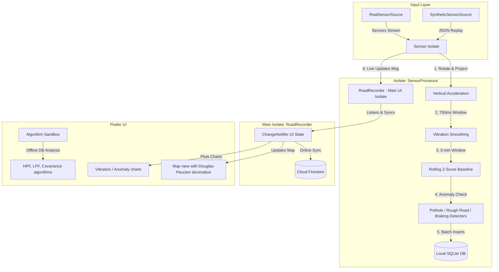

# Road Quality Mapper - Architecture & Structural Guide

This document provides a high-level overview of the Road Quality Mapper codebase, its system architecture, data flow, key files, and algorithms. Read this guide to understand the system design without needing to inspect the entire codebase.

---

## 0. System Context

Road Quality Mapper is a **Flutter application** that runs on two distinct surfaces:

| Surface | Description |
|---|---|
| **Mobile app** (iOS / macOS) | Records sensor data live, runs all processing on-device, stores to SQLite, then syncs to Cloud Firestore on trip stop. |
| **Web dashboard** (`web_dashboard.dart`) | Read-only view that fetches synced trips from Cloud Firestore and renders them on a map. No local sensor access. |

**External dependencies:**

| Package / Service | Role |
|---|---|
| `sensors_plus` | Raw accelerometer, user-accelerometer, and gyroscope event streams |
| `geolocator` | GPS position stream and permission management |
| `vector_math` | 3-D vector projection (gravity rotation) |
| `sqflite` (SQLite) | Primary local persistence; write path during recording |
| `cloud_firestore` | Secondary persistence; synced once per trip on stop; source of truth for the web dashboard |
| `wakelock_plus` | Keeps screen/CPU alive during a recording session |

**Key design decisions:**

- **Isolate for sensor processing** — All sensor math runs in a Dart `Isolate` (`SensorProcessor`) so the UI thread is never blocked by high-frequency IMU callbacks (up to 100 Hz). The isolate communicates back via `SendPort`/`ReceivePort` messages.
- **SQLite-first, Firestore-secondary** — Writes go to SQLite in batches every 1.5 s so a network outage can't lose a trip. Firestore upload happens once, atomically, when the user taps Stop.
- **Adaptive sampling** — The accelerometer sample rate dynamically increases from baseline Hz to trigger Hz when a pre-trigger Z-score threshold is crossed, then reverts after a burst window. This balances battery life against detection resolution.

---

## 1. System Architecture & Data Flow



---

## 2. File Map (Repository Structure)

### Core Code (`lib/`)

*   **[models.dart](file:///Users/suyashpandya/Desktop/pothole_finder/lib/models.dart)**: Defines core data structures.
    *   `GpsSample`: Represents GPS position, speed, and associated vertical vibration/anomaly flags.
    *   `AccelSample`: High-frequency vertical acceleration values and their rolling Z-scores.
    *   `Trip`: Metadata for a recording session (fidelity, scenario, vehicle, mount type).
    *   `DetectionConfig`: Shared thresholds (speed gates, stability angles, adaptive sampling).
*   **[sensor_source.dart](file:///Users/suyashpandya/Desktop/pothole_finder/lib/sensor_source.dart)**: Abstraction of hardware feeds.
    *   `RealSensorSource`: Wraps physical GPS and accelerometer/gyro streams via `sensors_plus` and `geolocator`.
    *   `SyntheticSensorSource`: Replays a JSON-based IMU and GPS trace file to simulate real drives.
*   **[sensor_isolate.dart](file:///Users/suyashpandya/Desktop/pothole_finder/lib/sensor_isolate.dart)**: Background thread (`SensorProcessor`) that processes high-frequency sensor readings, computes road anomalies, and batches writes to SQLite to avoid UI stutter.
*   **[road_db.dart](file:///Users/suyashpandya/Desktop/pothole_finder/lib/road_db.dart)**: SQLite database interface. Handles schema versioning, indices, and transactional inserts of samples.
*   **[recorder.dart](file:///Users/suyashpandya/Desktop/pothole_finder/lib/recorder.dart)**: Main-thread controller (`RoadRecorder`). Coordinates background isolate spawning, listens for live messages, manages wakelocks, and pushes completed trip data to Cloud Firestore.
*   **[main.dart](file:///Users/suyashpandya/Desktop/pothole_finder/lib/main.dart)**: Entry point and primary mobile UI. Implements live map rendering, real-time chart plots, manual tapping annotations, and active alert prompts.
*   **[history.dart](file:///Users/suyashpandya/Desktop/pothole_finder/lib/history.dart)**: Renders a list of completed trips, allowing the user to load previous tracks onto the map or launch them in the algorithm sandbox.
*   **[sandbox.dart](file:///Users/suyashpandya/Desktop/pothole_finder/lib/sandbox.dart)**: Sandbox interface for offline algorithm evaluation. Plays back raw trip records through different digital signal processing filters (High-Pass, Low-Pass, Covariance Gating) to compare accuracy.
*   **[web_dashboard.dart](file:///Users/suyashpandya/Desktop/pothole_finder/lib/web_dashboard.dart)**: A web-specific screen that fetches and displays synchronized trips and map overlays directly from Cloud Firestore.

### Scripts & Tests

*   **[test/unit_test.dart](file:///Users/suyashpandya/Desktop/pothole_finder/test/unit_test.dart)**: Extensive unit test suite validating gravity vector projection, rolling averages, Z-score mathematics, Douglas-Peucker decimation, and background isolate logic.
*   **[scripts/doctor.sh](file:///Users/suyashpandya/Desktop/pothole_finder/scripts/doctor.sh)**: Environment validation script verifying toolchain targets.

---

## 3. Core Algorithms Reference

### A. Vertical Acceleration Projection (Gravity Rotation)
To isolate vehicle suspension movement regardless of how the phone is angled in the mount:
1. We compute a rolling average gravity vector $\vec{g}$ using accelerometer inputs during quiet periods.
2. The dynamic user acceleration $\vec{a}_{\text{user}}$ is projected onto the normalized gravity vector $\vec{u}_g = \frac{\vec{g}}{\|\vec{g}\|}$:
   $$\text{vertAccel} = \vec{a}_{\text{user}} \cdot \vec{u}_g$$
*Location: [sensor_isolate.dart](file:///Users/suyashpandya/Desktop/pothole_finder/lib/sensor_isolate.dart)*

### B. 750ms Rolling Average Vibration Smoothing
To smooth out high-frequency noise, we run a sliding window average over vertical acceleration. The window duration is hardcoded to $750$ milliseconds.
*Location: [sensor_isolate.dart](file:///Users/suyashpandya/Desktop/pothole_finder/lib/sensor_isolate.dart) and [sandbox.dart](file:///Users/suyashpandya/Desktop/pothole_finder/lib/sandbox.dart)*

### C. 5-Minute Rolling Z-Score Baseline
To dynamically adjust anomaly detection thresholds based on current road roughness (e.g., freeway driving vs. gravel paths):
1. We compute a sliding $5$-minute mean ($\mu$) and standard deviation ($\sigma$) of the smoothed vertical vibration values.
2. For each new sample, the Z-score is:
   $$Z = \frac{x - \mu}{\sigma}$$
3. A pothole is triggered if the Z-score exceeds a configured threshold (typically $Z > 2.5$).
*Location: [sensor_isolate.dart](file:///Users/suyashpandya/Desktop/pothole_finder/lib/sensor_isolate.dart)*

### D. Douglas-Peucker Path Decimation
For high-performance map rendering, GPS polylines are simplified on-the-fly using the Douglas-Peucker recursive decimation algorithm with an $\epsilon \approx 5$ meters. This significantly reduces leaf nodes and prevents browser crashes.
*Location: [main.dart](file:///Users/suyashpandya/Desktop/pothole_finder/lib/main.dart) and [web_dashboard.dart](file:///Users/suyashpandya/Desktop/pothole_finder/lib/web_dashboard.dart)*

---

## 4. Local Database Schema (SQLite)

The local SQLite database holds three tables:
1. **`trips`**: Stores start/end times, preset fidelity (High/Medium/Low), and metadata like `scenario`, `vehicle`, and `mount_type`.
2. **`gps_samples`**: Records GPS path coordinates (`lat`, `lon`), speed, speed/heading accuracy, color-coded vibration intensity (green/yellow/red), computed Z-score, raw IMU values, and binary event flags (`is_braking`, `is_tapping`).
3. **`accel_samples`**: Raw vertical accelerations, smoothed values, and Z-scores used during high-fidelity playback or algorithm sandbox experiments.

---

## 5. Data Lifecycle: Raw Sample → Firestore

```
IMU event (sensors_plus)
  └─► SensorProcessor (Isolate)
        ├─ gravity low-pass filter  →  stable gravity vector
        ├─ userAccel dot gNorm      →  vertical acceleration
        ├─ 750 ms rolling average   →  smoothed vibration
        ├─ 5-min Z-score baseline   →  zScore
        ├─ anomaly detectors        →  IsolateAnomalyAlert (→ main isolate → UI toast)
        └─ 1.5 s batch flush        →  SQLite accel_samples

GPS event (geolocator)
  └─► SensorProcessor (Isolate)
        ├─ accuracy gate (>25 m dropped)
        ├─ attach latest smoothed + zScore + color
        ├─ 1.5 s batch flush        →  SQLite gps_samples
        └─ IsolateDataMessage       →  RoadRecorder (main isolate) → UI map point

RoadRecorder.stop()
  └─► SQLite endTrip()
  └─► Firestore trips/{docId}.set({ ...metadata, samples: [...gps_samples] })
```

**Component responsibility summary:**

| Component | Owns |
|---|---|
| `SensorProcessor` (isolate) | Sensor math, anomaly detection, adaptive sampling, SQLite batching |
| `RoadRecorder` (main isolate) | Trip lifecycle, wakelock, Firestore upload, UI state (`ChangeNotifier`) |
| `RoadDb` | Schema, migrations, transactional reads/writes |
| `main.dart` UI | Map rendering (Douglas-Peucker), live charts, anomaly alerts, manual tapping |
| `web_dashboard.dart` | Firestore read + map display only — no sensor or SQLite access |

---

## 6. Anomaly Detection Thresholds

All thresholds live in `DetectionConfig` ([models.dart](lib/models.dart)).

| Event | Trigger condition | Cooldown |
|---|---|---|
| **Pothole** | Z-score ≥ 4.0 | 3 s |
| **Rough road** | Z-score ≥ 3.0 sustained for ≥ 3 s (1 s grace gap allowed) | 10 s |
| **Sudden braking** | Smoothed horizontal acceleration > 0.35 g (300 ms low-pass) | 4 s |
| **Manual tapping** | User tap on screen during recording | — |

All detectors are suppressed when:
- Speed is below the GPS speed gate (`DetectionConfig.gpsSpeedGateKmh`)
- Gyroscope magnitude exceeds `DetectionConfig.gyroThresholdRads` (phone being re-mounted)
- Gravity vector drifts more than `DetectionConfig.mountStabilityAngleDeg` within the stability window

---

## 7. Verification Commands

To verify that the code and filters build and pass requirements:
```bash
# Run all unit tests
flutter test test/unit_test.dart
```
